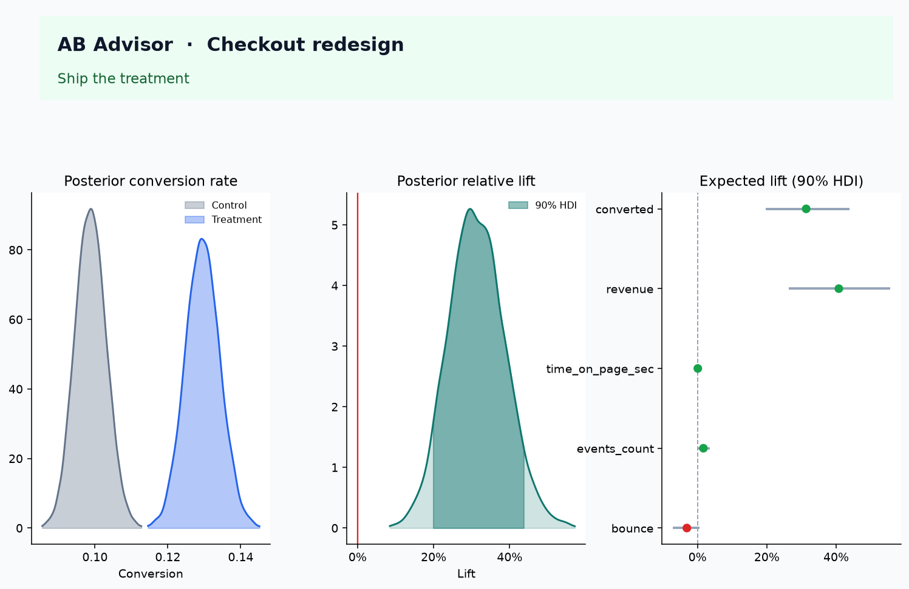

# AB Advisor

**Bayesian A/B test analyzer for product decisions.**

Upload experiment data (user IDs, variant assignment, metrics). AB Advisor fits conjugate Bayesian models per metric and turns the posteriors into something a launch review can actually use:

> There is a **99.9%** probability the new checkout increases conversion, with an expected lift of **+24%**. The 90% highest-density interval is **[+17%, +32%]** — it does not include zero. Expected loss if you ship is tiny compared with holding.

That's not a p-value. A p-value answers *"how surprising is this data if nothing changed?"* Nobody walks into an exec review to discuss surprisingness — they walk in to decide whether to ship.



## Why Bayesian (and why it's harder)

| Frequentist t-test / z-test | AB Advisor |
|---|---|
| p = 0.04 | P(treatment > control) = 97% |
| "Significant" vs "not" | Expected lift, 90% HDI, chance of beating the MDE |
| Invalid if you peek | Probability and expected-loss rules stay valid under sequential monitoring |
| Binary conversion only in the simple case | Conversion, revenue (including zeros), counts, continuous, skewed |

The cost is real: you have to pick a **prior**, a **minimum useful lift (MDE)**, and a **loss threshold**. Those are product judgments, not statistical afterthoughts — AB Advisor puts them in the sidebar as explicit controls instead of hiding them behind a stats-package default.

## Quick start

```bash
python -m venv .venv
source .venv/bin/activate        # Windows: .venv\Scripts\activate
pip install -r requirements.txt

python -m src.data_gen           # writes data/sample_experiment*.csv
streamlit run app.py
```

Open the app, leave **Checkout redesign (clear win)** selected in the sidebar, and click **Run Bayesian analysis**.

### Headless / CI

```bash
python -m src.cli data/sample_experiment.csv --name "Checkout redesign" --out docs/experiment_review.md
pytest -q
```

### Optional LLM narrative

The written summary is a deterministic template by default — no external calls, no dependency on an API key. If you set an API key, AB Advisor asks an LLM to *rewrite* the same computed numbers into a tighter narrative; the model only ever sees the structured JSON output of the Bayesian engine, never the raw data, and is instructed never to invent a figure. If the key is missing or the call fails for any reason, the app falls back to the template.

**DeepSeek** (OpenAI-compatible) is the default provider:

```bash
export DEEPSEEK_API_KEY=sk-...
streamlit run app.py
# or, from the CLI:
python -m src.cli data/sample_experiment.csv --name "Checkout redesign" --llm
```

Default endpoint `https://api.deepseek.com`, default model `deepseek-v4-flash` (thinking disabled, to keep the brief tight). Override with `DEEPSEEK_MODEL` or the sidebar's model field. Set `OPENAI_API_KEY` (and optionally `LLM_PROVIDER=openai`) to use OpenAI instead.

## Input format

**Wide** — one row per user:

```text
user_id,variant,converted,revenue,time_on_page_sec,events_count,bounce
c-00001,control,0,0.00,162.4,2,1
t-00018,treatment,1,54.20,171.1,4,0
```

**Long** — one row per user × metric:

```text
user_id,variant,metric_name,metric_value
c-00001,control,converted,0
c-00001,control,revenue,0.00
```

User, variant, and metric columns are auto-detected from common aliases (`variant`/`group`/`arm`/`bucket`, `user_id`/`uid`/`visitor_id`, etc.). Variant labels `A`/`B`, `0`/`1`, `control`/`treatment` are normalized automatically. Multiple metrics run in one pass, and each gets its own conjugate model — see below.

## What the engine actually does

No PyMC sampling loop — each metric family has a closed-form conjugate posterior, so a dashboard refresh is milliseconds, not minutes. Monte Carlo (~20k draws by default) is used only to turn two posteriors into P(better), lift, HDI, and expected loss.

| Metric pattern | Model | Default prior |
|---|---|---|
| 0/1 conversion, bounce | Beta–Binomial | Beta(1, 1) — uniform |
| Continuous (time on page) | Unknown mean & variance → Student-t on the mean | Weakly informative |
| Strictly positive & skewed | Log-normal mean | Inverse-χ² on log-variance |
| Counts (events) | Gamma–Poisson | Gamma(1, 1) |
| Revenue with many zeros (ARPU) | Hurdle: Beta conversion × log-normal spend given convert | Same as above |

Metric type is auto-detected from the values (binary, integer/low-cardinality → Poisson, zero-inflated & skewed → hurdle log-normal, positive & skewed → log-normal, else Normal) and can be overridden per metric in the UI.

For each metric the report includes:

1. **P(treatment > control)** — probability of improvement (direction flips automatically for "lower is better" metrics like bounce or latency).
2. **Expected relative lift** — mean of the posterior on (treatment − control) / control.
3. **90% HDI** (configurable) — shortest interval containing the credible mass of the posterior lift.
4. **P(lift > MDE)** and **P(harm beyond MDE)** — probability of clearing your minimum useful lift, or of a harmful move past it.
5. **ROPE probability** — share of posterior mass inside a "too small to care about" band, used to call futility.
6. **Expected loss** of shipping vs. holding, on the metric's raw scale.
7. A frequentist p-value, included **only as a footnote** so you can translate for teams that still ask for one.

### Expected loss — the actual decision rule

If you ship the treatment, you lose whenever it's actually worse:

AB Advisor's decision engine (`src/decisions.py`) ships when P(better) and P(beat MDE) both clear their bars, *or* when expected loss from shipping is small relative to the expected loss from holding — the same logic GrowthBook-style Bayesian experimentation stacks use, and more honest than "p < 0.05."

## Decision engine

Every metric gets a role — **primary**, **guardrail**, or **secondary** — inferred from its name (`conversion`/`revenue`/`checkout` → primary; `bounce`/`error`/`latency`/`refund`/`churn` → guardrail; everything else → secondary) or set explicitly. Per-metric actions (`ship` / `hold` / `stop_futility` / `keep_running` / `block`) roll up into one experiment-level call:

- **Ship** — every primary metric clears the ship bar and no guardrail is at risk.
- **Hold** — a guardrail shows material harm (this blocks shipping even if the primary metric won), or a primary metric is a clear loss.
- **Keep running** — evidence is still mixed on a primary metric; the pre-registered stopping rule hasn't been hit yet.
- **Investigate** — a sample-ratio-mismatch (SRM) check on the actual vs. expected control/treatment split fails a chi-square test, meaning traffic isn't splitting as designed. Nothing downstream is trustworthy until this is explained, so AB Advisor refuses to recommend shipping.

## Dashboard

Three tabs:

1. **Analyze experiment** — upload a CSV or pick a bundled sample; confirm the user/variant/metric columns and per-metric type, role, and direction (all auto-detected, all overridable); set HDI mass, MDE, ROPE, ship threshold, and an optional historical-conversion prior; run the analysis to get KPI cards, a forest plot across metrics, posterior density overlays, the lift distribution with shaded HDI, expected-loss bars, a probability gauge, the written narrative, and a downloadable Markdown/HTML report (print the HTML to PDF for a leave-behind).
2. **Sample size planner** — simulate binary experiments at a hypothesized lift and report how many users per arm you'd need before P(better) reliably clears your ship threshold.
3. **How to read results** — a plain-English glossary of P(better), HDI, expected loss, and ROPE, for reviewers who aren't going to read this README.

## Repository layout

```text
app.py                         Streamlit UI (3 tabs: analyze, sample size, guide)
src/bayesian.py                Conjugate posteriors + Monte Carlo summaries
src/metrics.py                 Wide/long loaders, column detection, type inference, SRM check
src/decisions.py               Ship / hold / keep-running / investigate rules
src/summarize.py               Deterministic templates + optional DeepSeek/OpenAI rewrite
src/visualize.py               Plotly posteriors, lift, forest plot, gauges
src/report.py                  Markdown/HTML experiment review + sample size planner
src/data_gen.py                Synthetic checkout + underpowered datasets (known effects)
src/cli.py                     Batch report generation from a CSV, no Streamlit required
scripts/render_screenshots.py  Regenerates the PNGs in screenshots/ from the sample data
data/                          Bundled sample CSVs (wide, long, underpowered)
notebooks/bayesian_demo.ipynb  Walkthrough of the math against the sample dataset
docs/                          Example experiment-review memos (see below)
tests/                         Engine, loaders, decision rules, LLM fallback (pytest)
```

## For product managers

### Choosing metrics

- **North star / primary** — the reason the experiment exists (conversion, revenue). Pre-register one before launch. AB Advisor won't let a pretty secondary metric outvote a weak primary.
- **Guardrails** — bounce, errors, refunds, latency. A guardrail with material probability of harm **blocks shipping**, even if the primary metric won.
- **Secondary** — time on page, event counts. Learning only. An inconclusive secondary metric does not stall a clean primary win.

### Setting priors from history

If last quarter's checkout converted at 10% and you'd trust that as roughly 100 users' worth of information (not 100,000 — you don't want the past to dominate a live test), set:

- Prior mean = 0.10, strength = 100 → Beta(10, 90) in the sidebar.

The prior's influence shrinks automatically as the experiment's own `n` grows. Strength 2 (the uniform default) is the right starting point whenever you're unsure.

### Talking to executives

Don't say "we got significance." Say:

1. **Probability the change is positive.**
2. **How big we think it is** — expected lift and its interval.
3. **What we risk if we're wrong** — expected loss, guardrail status.
4. **What we'll do next** — ramp, hold, or wait for the pre-registered bar.

[`docs/sample_experiment_review.md`](docs/sample_experiment_review.md) is the tone to copy for a real write-up.

### Peeking and sequential monitoring

If you refresh this dashboard daily and stop the moment P(better) crosses 95%, that's a **valid Bayesian sequential rule** — provided the threshold was set in advance. It is **not** valid to peek repeatedly and then also quote a frequentist p-value as if `n` were fixed from the start. The p-value shown in the results table is a translation aid only; don't mix the two stories in one review.

## Sample data (known effects)

`data/sample_experiment.csv` — a checkout redesign, 5,000 users per arm (seed 42):

| Metric | Control | Treatment | What you should see |
|---|---|---|---|
| `converted` | 9.9% | 12.9% | Clear ship — P(better) ≈ 100%, expected lift ≈ +31% |
| `revenue` (ARPU, zeros included) | ~$5.39 | ~$7.56 | Clear ship via the hurdle model, expected lift ≈ +41% |
| `time_on_page_sec` | ~180s | ~180s | Null — HDI includes 0, flagged `stop_futility` |
| `events_count` | ~3.03 | ~3.08 | Mild / inconclusive (P(better) ≈ 93%, but doesn't clear the MDE bar) |
| `bounce` | 41.6% | 40.3% | Mild improvement (lower is better) — doesn't block shipping |

Run `python -m src.cli data/sample_experiment.csv --name "Checkout redesign"` to reproduce this exactly — the overall call is **ship**.

`data/sample_underpowered.csv` is the same experiment design at n = 400/arm with a much smaller true lift. AB Advisor correctly calls this **keep running**, not "not significant, kill it" — the point of the second dataset is to prove the tool doesn't default to false confidence just because a metric moved in the right direction.

`data/sample_experiment_long.csv` is the same checkout data in long format, for testing that ingestion path.

## Limitations (read before you ship)

- **Independence / SUTVA.** Users are assumed not to interfere with each other. Marketplace, social, or shared-cache effects need a different design.
- **Assignment must be random and logged correctly.** A sample-ratio mismatch is flagged with a chi-square test; if it fires, the recommendation is *investigate*, not ship, regardless of how good the metrics look.
- **Model family must match the metric.** A skewed revenue column forced through a Normal model will lie. Auto-detection is a starting point — override the type in the UI if it looks wrong.
- **Multiple metrics inflate false discovery.** Watching a dozen KPIs raises the chance something looks good by chance. Pre-register the primary metric; treat the rest as guardrails or learning.
- **No CUPED / variance reduction, no switchback design, no clustered users.** Those are reasonable extensions, not in this version.
- **The LLM can't invent numbers, but it can still over-smooth a caveat.** Prefer the template narrative when the decision is contentious or the write-up is going somewhere high-stakes.

## Tests

```bash
pytest -q
```

25 tests covering: a known conversion lift resolving to P(better) → 1, a true null resolving to an HDI that contains 0, Poisson rates, the hurdle revenue model, long-format CSV ingestion, SRM detection, the ship/hold/keep-running/investigate decision rules, and the LLM fallback path when no key is configured.

## License

No license file is included yet — add one (MIT is a reasonable default for a portfolio project like this) before treating the repo as open for external reuse.
